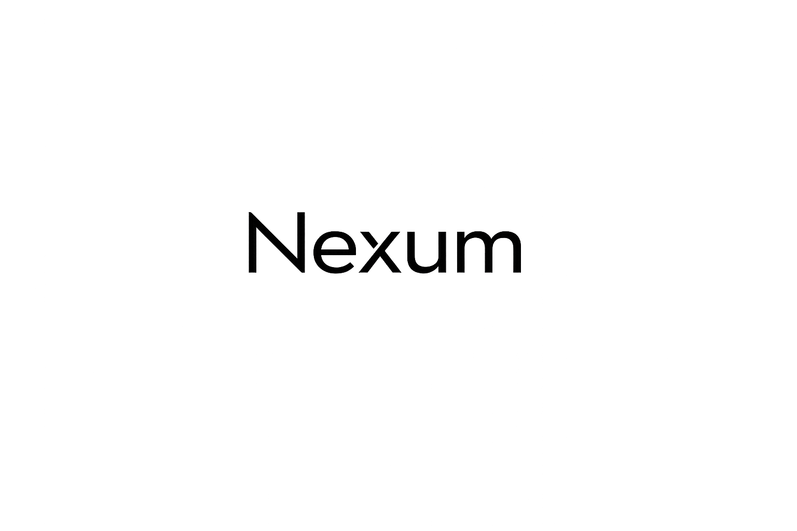

# Nexum Web

Official landing page for [Nexum](https://github.com/hectoresen/voice_mvp) - A minimal, self-hosted voice and chat communication system.



## About Nexum

Nexum is a lightweight alternative to Discord and TeamSpeak. Built with Rust, Tauri & React, it provides:

- 🔒 **Self-Hosted** - Run your own server locally or remotely. Your data, your rules.
- 🚫 **No Accounts** - Just enter a username and connect. No email, no registration.
- ⚡ **Lightweight** - Efficient resource usage with modern desktop UI
- 💬 **Text Chat** - Real-time messaging with SQLite persistence
- 🎙️ **Voice Chat** - Low-latency voice communication via UDP
- ⚙️ **Easy Management** - Manage server from client UI

## Quick Start

This is a static website built with HTML, CSS, and JavaScript. No build step required - CSS is pre-compiled.

### Local Development

```bash
# Install http-server globally (if not already installed)
npm install -g http-server

# Serve the website
http-server -p 8000

# Open http://localhost:8000
```

### Deploy to Vercel

```bash
# Install Vercel CLI
npm i -g vercel

# Deploy
vercel
```

The `vercel.json` configuration is already set up for static site deployment.

## Project Structure

```
nexum_web_mvp/
├── index.html           # Main landing page
├── vercel.json          # Vercel deployment config
├── assets/
│   ├── css/            # Pre-compiled stylesheets
│   ├── js/             # JavaScript libraries
│   ├── img/            # Images and logos
│   └── scss/           # Source SCSS files (optional)
├── examples/           # Additional example pages
└── docs/              # Documentation pages
```

## Technology Stack

- **Framework**: Bootstrap 4 (Argon Design System)
- **Fonts**: Inter (logo), Open Sans (body text)
- **Icons**: Font Awesome 5, Nucleo Icons
- **JavaScript**: jQuery, Popper.js, Bootstrap plugins

## Browser Support

Supports the last 2 versions of all major browsers:

- Chrome
- Firefox
- Safari
- Edge
- Opera

## Development

### Modifying Styles (Optional)

If you want to customize SCSS:

```bash
# Install dependencies
npm install

# Compile SCSS
npx gulp compile-scss
```

Pre-compiled CSS is already included, so this step is optional.

## Links

- **Main Repository**: [voice_mvp](https://github.com/hectoresen/voice_mvp)
- **Landing Page**: [Deployed on Vercel](https://nexum.vercel.app) _(pending deployment)_

## License

Based on [Argon Design System](https://www.creative-tim.com/product/argon-design-system) by Creative Tim (MIT License).

Customized for the Nexum project.

## Credits

- Design System: [Argon Design System](https://github.com/creativetimofficial/argon-design-system) by Creative Tim
- Project: Nexum by [@hectoresen](https://github.com/hectoresen)
